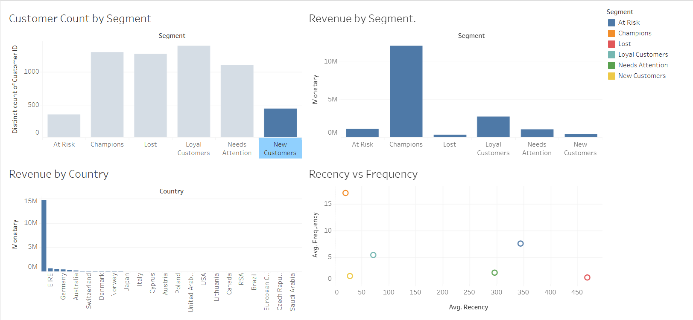

# E-commerce Customer Segmentation & RFM Analysis

Customer segmentation and campaign performance analysis to identify which customer segments drive the most revenue and which high-value segments are at risk of churning.

Dashboard: https://public.tableau.com/views/E-commerceCustomerSegmentationDashboard/E-commerceCustomerSegmentationDashboard?:language=en-US&:display_count=n&:origin=viz_share_link

## Dashboard Preview

## Business Question

Which customer segments generate the most revenue, and which high-value segments are at risk of churning, based on purchase history?

## Dataset

[Online Retail II](https://www.kaggle.com/datasets/mashlyn/online-retail-ii-uci) — UK-based online retailer transaction data, Dec 2009 to Dec 2011, sourced from Kaggle/UCI Machine Learning Repository.

- 1,067,371 raw transaction line items
- 805,549 rows after cleaning
- 5,878 unique customers analyzed

## Process

Raw CSV data was cleaned in Python, then RFM metrics were calculated and validated against an equivalent SQL query. Customers were scored and segmented, cross-referenced against country-level revenue, and the results were loaded into Tableau for the final dashboard.

1. Data cleaning (Python/pandas) — remove missing Customer IDs, cancelled invoices, invalid quantity/price rows
2. RFM calculation (Python and SQL) — Recency, Frequency, Monetary per customer
3. Scoring and segmentation — quintile scoring (1-5) per metric, six customer segments
4. Country-level analysis — revenue and segment mix by market
5. Dashboard — built in Tableau Public

## Methodology: RFM Segmentation

| Metric | Definition |
|---|---|
| Recency | Days since the customer's last purchase |
| Frequency | Number of distinct purchases (invoices) |
| Monetary | Total revenue generated by the customer |

Each customer was scored 1-5 on each metric using quintiles, then assigned to one of six segments: Champions, Loyal Customers, At Risk, Needs Attention, New Customers, Lost.

Data cleaning rules:
- Removed rows with missing Customer ID
- Removed cancelled invoices (Invoice numbers starting with "C")
- Removed rows with non-positive Quantity or Price
- Calculated Revenue as Quantity multiplied by Price

## Tech Stack

- Python (pandas) — data cleaning, RFM calculation, segmentation logic
- SQL (SQLite) — RFM query validated against the Python output
- Tableau Public — interactive dashboard

## Project Structure
scripts/ Python data cleaning and RFM analysis
sql/ SQL version of the RFM query
dashboard/ Dashboard screenshot
summary/ Findings and business recommendations

## Key Findings

Full findings and business recommendations are in [summary/findings_summary.md](summary/findings_summary.md).

- Champions make up 22 percent of customers but generated roughly 68 percent of total revenue (£12M of £17.7M)
- The United Kingdom dominates in total revenue but has a much lower average revenue per customer than smaller markets like EIRE and the Netherlands, suggesting those markets include bulk or reseller buyers
- Roughly 29 percent of UK customers fall into the At Risk or Lost segments, representing a significant revenue recovery opportunity

## Why RFM

RFM was chosen over more complex methods, such as churn prediction models, because it is simple, interpretable to non-technical stakeholders, and does not require labeled outcome data. This makes it a reasonable starting point for segmentation without ML infrastructure. Its main limitation is that it is descriptive rather than predictive — it does not account for product category or acquisition channel, and it does not forecast future behavior.

## Author

Anevia Bakone
